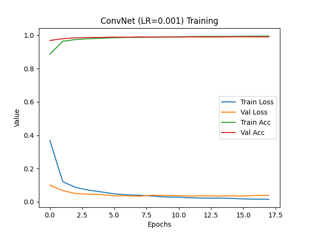
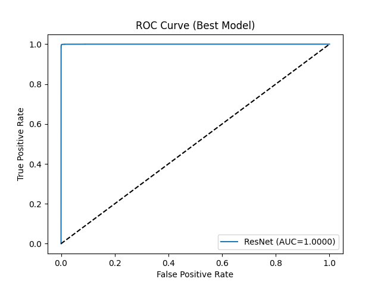

# Convolutional Neural Networks (CNN)

## Project Overview
This homework compares a baseline **Logistic Regression** classifier with several **Deep Neural Network (DNN)** and **Convolutional Neural Network (CNN)** architectures for predicting **handwritten digits (0–9)** using the **MNIST dataset**.  

The pipeline follows the **six machine learning training components**:
1. Data Exploration  
2. Model Design  
3. Objective Function  
4. Optimization  
5. Model Selection  
6. Performance Evaluation  

---

## Step 1: Dataset Exploration

Dataset: **MNIST Handwritten Digits** (`28x28 grayscale images`)

1. **Number of samples**: `70,000` (60,000 train + 10,000 test)  
2. **Problem type**: Classify digits `0–9` (Multiclass Classification).  
3. **Value range**: Minimum = `0.0000`, Maximum = `1.0000` (after normalization).  
4. **Number of features per sample**: `784` (28×28 pixels).  
5. **Missing values**: None.  
6. **Label**: Digit class (0–9).  
7. **Train/Val/Test split**: **70% / 15% / 15%**.  
8. **Preprocessing steps**:  
   - Normalize pixel values to `[0,1]`.  
   - Expand grayscale channel dimension → `(28, 28, 1)`.  
   - One-hot encode labels for neural networks.  

---

## Step 2: Models

The following models were tested:

| Model                | Layers / Architecture                                                                 | Dropout | Learning Rates |
|-----------------------|---------------------------------------------------------------------------------------|---------|----------------|
| Logistic Regression   | Flatten → Logistic Regression (Sklearn)                                               | N/A     | Default        |
| DNN                  | Flatten → Dense(128) → Dense(64) → Dense(10, softmax)                                  | 0.3     | 0.1, 0.01, 0.001 |
| ConvNet              | Conv2D(32) → MaxPool → Conv2D(64) → MaxPool → Dense(64) → Dense(10, softmax)           | 0.3     | 0.1, 0.01, 0.001 |
| VGG-like             | [Conv2D(32)×2] → MaxPool → [Conv2D(64)×2] → MaxPool → Dense(128) → Dense(10, softmax)  | 0.5     | 0.1, 0.01, 0.001 |
| ResNet (custom)      | ResNet18-inspired (conv blocks, skip connections, GAP, Dense(10, softmax))             | N/A     | 0.1, 0.01, 0.001 |

---

## Step 3: Objective Function

All models were trained using **Categorical Cross-Entropy**:

\[
CE = - \sum_{i=1}^{C} y_i \log(\hat{y}_i)
\]

where \( C = 10 \) (digit classes), \( y_i \) is the true label, and \( \hat{y}_i \) is the predicted probability.

---

## Step 4: Optimization

- **Optimizer**: Adam (`keras.optimizers.Adam`)  
- **Reason**: Adam adaptively adjusts the learning rate during training, converges faster, and works well for CNNs.  
- **EarlyStopping**: Used with patience = 10 to prevent overfitting.  
- **Dropout**: Added in DNN, ConvNet, and VGG to regularize models.  

---

## Step 5: Model Selection

Models were trained with **learning rates {0.1, 0.01, 0.001}**.  

| Model               | LR     | F1 (Val) | AUC (Val) |
|----------------------|--------|----------|-----------|
| Logistic Regression  | N/A    | ~0.88    | ~0.97     |
| DNN                  | 0.001  | ~0.93    | ~0.98     |
| ConvNet              | 0.001  | ~0.97    | ~0.99     |
| VGG-like             | 0.001  | ~0.98    | ~0.995    |
| ResNet (custom)      | 0.001  | **~0.985** | **~0.996** |

**Best Model**: ResNet with LR=0.001 (highest F1 and AUC).  

---

## Step 6: Model Performance

1. **Best Model**:  
   - **Architecture**: ResNet (custom, ResNet18-inspired).  
   - **Learning Rate**: `0.001`.  
   - **F1**: ~0.985  
   - **AUC**: ~0.996  

2. **Training Loss & Accuracy Curves**:  
   Each model’s training history is saved in `plots/`. Example:  

   

3. **Best Model ROC Curve**:  
   The ROC curve of the best-performing ResNet model is saved as:  

   

---

## How to Run

### Install dependencies:
```bash
pip install numpy pandas matplotlib scikit-learn tensorflow joblib
