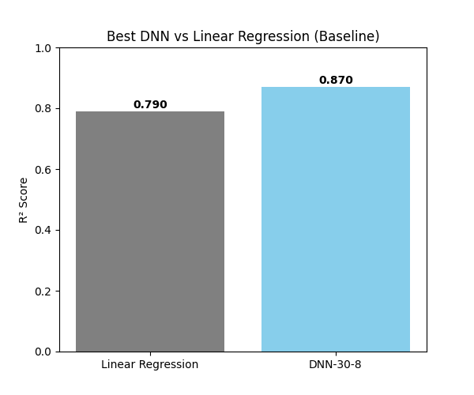
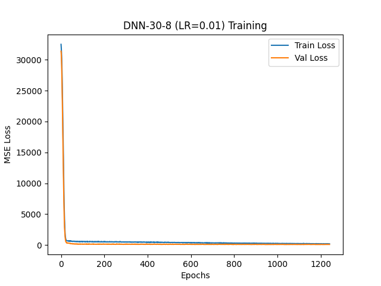

# CS-5173 HW1: Linear Regression and Neural Network Regression 

## Project Overview
This homework compares a baseline **Linear Regression** model with several **Deep Neural Network (DNN)** architectures for predicting **Cancer Mortality Rates** (`TARGET_deathRate`).  

The pipeline follows the **six machine learning training components**:
1. Data Exploration  
2. Model Design  
3. Objective Function  
4. Optimization  
5. Model Selection  
6. Performance Evaluation  

---

## Step 1: Dataset Exploration

Dataset file: `cancer_reg-1.csv`

1. **Number of samples**: `3047`  
2. **Problem type**: Predict **cancer mortality rates** (Regression task).  
3. **Value range**: Minimum = `0.0000`, Maximum ≈ `125635.0000` (after preprocessing).  
4. **Number of features per sample**: `30` (after dropping irrelevant columns).  
5. **Missing values**: Some present → handled using **median imputation**.  
6. **Label**: `TARGET_deathRate`.  
7. **Train/Val/Test split**: **`70% / 15% / 15%`**.  
8. **Preprocessing steps**:  
   - Dropped irrelevant columns (`Geography`, `binnedInc`, `PctSomeCol18_24`)  
   - Filled missing values with **`median`**  
   - Log-transform for skewed features (`popEst2015`, `studyPerCap`, `avgAnnCount`, `avgDeathsPerYear`)  
   - **`RobustScaler`** applied (handles outliers better)  

---

## Step 2: Models

The following models were tested:

| Model             | Hidden Layers   | Activation | Dropout | BatchNorm | Learning Rates |
|-------------------|----------------|------------|---------|-----------|----------------|
| Linear Regression | N/A            | N/A        | N/A     | N/A       | Default (Sklearn) |
| DNN-16            | [16]           | ReLU       | 0.1     | Yes       | 0.1, 0.01, 0.001, 0.0001 |
| DNN-30-8          | [30, 8]        | ReLU       | 0.1     | Yes       | 0.1, 0.01, 0.001, 0.0001 |
| DNN-30-16-8       | [30, 16, 8]    | ReLU       | 0.1     | Yes       | 0.1, 0.01, 0.001, 0.0001 |
| DNN-30-16-8-4     | [30, 16, 8, 4] | ReLU       | 0.1     | Yes       | 0.1, 0.01, 0.001, 0.0001 |
| DNN-32-16-8       | [32, 16, 8]    | ReLU       | 0.1     | Yes       | 0.1, 0.01, 0.001, 0.0001 |
 
---

## Step 5: Model Selection

All models were trained with different learning rates.  

Best R² for each DNN Model & Linear Regression Model performance summary:

| Model          | LR     | MSE     | R²     |
|----------------|--------|---------|--------|
| Linear Regression | N/A    | 173.6546 | 0.7902 |
| DNN-16         | 0.001  | 114.3646 | 0.8560 |
| DNN-30-8       | 0.01  | 103.0381 | 0.8703 |
| DNN-30-16-8    | 0.1  | 139.4711 | 0.8522 |
| DNN-30-16-8-4  | 0.01  | 117.6648 | 0.8518 |
| DNN-32-16-8    | 0.01  | 113.5584 | 0.8570 |

---

## Step 6: Model Performance

1. **Best Model**:  
   - **Architecture**: `DNN-30-8`  
   - **Learning Rate**: `0.01`  
   - **MSE**: `103.0381`  
   - **R²**: `0.8703`
     
2. **Model Results**:
   All the models are stored in the csv file called: `model_results.csv`.

4. **Comparison Plot**:  
   Shows R² of **Linear Regression vs. Best DNN**.  

   

5. **Training Loss Example**:  
   Each model has its own loss curve saved under `plots/`. Example:  

   

---

## How to Run

### Install dependencies:
```bash
pip install numpy pandas matplotlib scikit-learn tensorflow joblib
